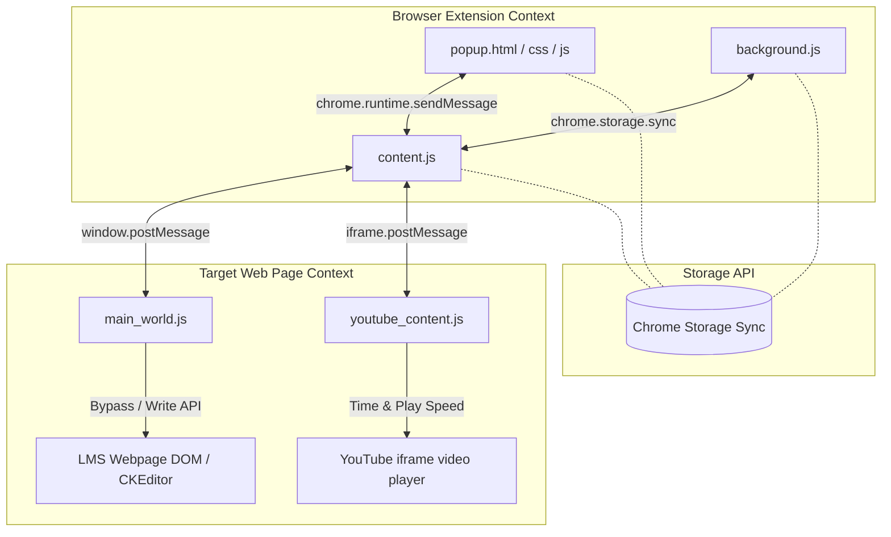

# BÁO CÁO DỰ ÁN: EDUBOT PRO - TRỢ LÝ TỰ HỌC E-LEARNING 📊

Dự án **EduBot Pro** là một tiện ích mở rộng (Chrome Extension) chạy trên nền tảng trình duyệt Chromium. Dự án được phát triển nhằm mục đích nghiên cứu các phương pháp can thiệp DOM (Document Object Model), tương tác với các khung soạn thảo nâng cao (Rich Text Editor) và tối ưu hóa trải nghiệm tự học trực tuyến thông qua việc tự động hóa các thao tác lặp đi lặp lại.

---

## I. THÔNG TIN CHUNG
- **Tên dự án**: EduBot Pro - Trợ Lý Tự Học E-Learning
- **Phiên bản hiện tại**: v3.4.0
- **Công nghệ cốt lõi**: HTML5, Vanilla CSS, JavaScript (ES6+), Chrome Extension APIs (Manifest V3)
- **Môi trường hoạt động**: Các trình duyệt nhân Chromium (Google Chrome, Microsoft Edge, Brave, Cốc Cốc...) trên các trang web học tập đích (`rikkei.edu.vn`, `rikkeiedu.com`) và môi trường giả lập thử nghiệm.

---

## II. KIẾN TRÚC KỸ THUẬT & PHÂN TÍCH THÀNH PHẦN

Hệ thống được thiết kế theo mô hình kiến trúc phi tập trung của Chrome Extension Manifest V3, chia làm 4 lớp ngữ cảnh chạy độc lập tương tác qua cơ chế truyền tin (Message Passing) của Chrome Runtime:



### 1. Lớp Nền tảng (Background Service Worker)
- **Tệp**: `background.js`
- **Vai trò**: Chạy dưới nền của trình duyệt độc lập với các tab. Nhiệm vụ chính là lắng nghe sự kiện cài đặt hoặc cập nhật của extension (`chrome.runtime.onInstalled`), khởi tạo các cấu hình mặc định (tự động học = BẬT, tự động chuyển bài = BẬT, tốc độ tua mặc định = 10 giây, tốc độ video mặc định = 2.0x) và lưu vào `chrome.storage.sync`.

### 2. Lớp Can thiệp DOM và Điều phối (Content Script)
- **Tệp**: `content.js`
- **Vai trò**: Được nhúng trực tiếp vào các trang web có tên miền khớp với các mẫu đăng ký trong `manifest.json`. Đây là bộ não điều hành chính của extension:
  - **SPA Route Change Detection**: Phát hiện các thay đổi trang động (Single Page Application) mà không tải lại trang bằng cách thiết lập bộ lặp thời gian quét liên tục (interval 2 giây) để so sánh URL hiện tại và loại trang hiện tại (Trang video hay trang bài đọc câu hỏi).
  - **Điều khiển trạng thái**: Nhận các cấu hình thay đổi từ popup Dashboard để cập nhật các tham số hoạt động (tốc độ tua, tốc độ phát, trạng thái bật/tắt tự động học).
  - **Tọa độ hóa các tiến trình**: Theo dõi tiến độ hoàn thành video, gọi lệnh tua video cục bộ, và kích hoạt tiến trình điền bài đọc sau khi phát hiện các câu hỏi.

### 3. Lớp Can thiệp Sâu Context (Main World Script)
- **Tệp**: `main_world.js`
- **Vai trò**: Do cơ chế bảo mật cô lập ngữ cảnh (isolated world) của Chrome Extension, Content Script không thể truy cập trực tiếp vào các biến toàn cục hay API JavaScript của trang web chính. Do đó, `main_world.js` được cấu hình chạy ở thế giới gốc `MAIN` của trang web:
  - **Bypass Confirm Dialog**: Ghi đè phương thức mặc định `window.confirm` của trình duyệt. Khi trang web học tập gọi hộp thoại hỏi ý kiến xác nhận nộp bài hoặc làm lại, script này tự động chặn lại và trả về `true` (tương đương nhấn OK), giúp tiến trình không bị gián đoạn.
  - **CKEditor Instance Injector**: Truy cập trực tiếp các thực thể soạn thảo rich text như CKEditor 5 để ghi câu trả lời chính xác vào mô hình dữ liệu của editor thông qua API chính thống của thư viện, tránh các lỗi mất dữ liệu khi người dùng bấm Lưu/Nộp bài.

### 4. Lớp Điều khiển Iframe (YouTube Content Script)
- **Tệp**: `youtube_content.js`
- **Vai trò**: Chạy riêng bên trong các iframe chứa video YouTube nhúng. Nó thực hiện:
  - Gửi thông tin tiến trình phát video (`currentTime` / `duration`) ra cửa sổ cha (`window.parent.postMessage`).
  - Lắng nghe các chỉ thị tua nhanh (`RikkeiBoosterTriggerSeek`) từ Content Script cha để thay đổi thời gian phát của video gốc.
  - Đồng bộ tốc độ phát (playbackRate) theo cấu hình người dùng thiết lập trên Dashboard.

### 5. Lớp Giao diện Người dùng (Popup Dashboard)
- **Tệp**: `popup.html`, `popup.css`, `popup.js`
- **Vai trò**: Cung cấp giao diện tương tác trực quan thiết kế dạng Glassmorphism hiện đại:
  - **Real-time Stats**: Hiển thị số lượng bài học hoàn thành, tính toán thời gian học tập tiết kiệm được dựa trên cơ chế lưu trữ bền vững.
  - **Live Terminal (Logger)**: Hiển thị chi tiết từng hành động của Bot dưới dạng bảng nhật ký trực tiếp giúp nhà phát triển hoặc học viên giám sát minh bạch.
  - **Manual Operations**: Cung cấp các nút bấm dự phòng (Tua video thủ công, Chuyển phần bài đọc, Tự điền bài đọc) khi người dùng muốn kích hoạt bằng tay.

### 6. Bộ Giả Lập Môi Trường (Simulation Test Harness)
- **Tệp**: `simulation.html`, `simulation.js`, `simulation.css`
- **Vai trò**: Một trang web độc lập giả lập hoàn toàn giao diện, cấu trúc DOM và hành vi của hệ thống LMS RikkeiEdu (bao gồm danh sách 25 bài học bài đọc/video, trình phát video, các câu hỏi tự luận CKEditor). Đây là môi trường hoàn hảo để phát triển, debug lỗi extension một cách an toàn mà không cần kết nối mạng hay gây ảnh hưởng đến dữ liệu học tập thực tế.

---

## III. CHI TIẾT CÁC GIẢI PHÁP VƯỢT RÀO CƠ CHẾ (BYPASS MECHANISMS)

### 1. Ghi đè thuộc tính Thời lượng Video (HTMLMediaElement.prototype.duration)
Trong môi trường kiểm thử hoặc một số trình duyệt thiếu bộ giải mã codec độc quyền (như AAC, H.264), thẻ `<video>` có thể báo lỗi hoặc thời lượng hiển thị dưới dạng `NaN` hoặc `0`. Để khắc phục và cho phép các thuật toán tua/tiến độ hoạt động bình thường, extension thực hiện ghi đè getter thuộc tính `duration` của prototype:
```javascript
const nativeLmsDurationGetter = Object.getOwnPropertyDescriptor(HTMLMediaElement.prototype, 'duration')?.get;
Object.defineProperty(HTMLMediaElement.prototype, 'duration', {
  get: function() {
    const realDur = nativeLmsDurationGetter ? nativeLmsDurationGetter.call(this) : NaN;
    if (Number.isFinite(realDur) && realDur > 0) return realDur;
    return 180; // Trả về thời lượng ảo 3 phút để phục vụ giả lập/kiểm thử
  },
  configurable: true
});
```

### 2. Tự động điền thông minh và an toàn (Smart Auto-Fill)
Khi chuyển sang bài đọc lý thuyết có câu hỏi tự luận, hệ thống thực hiện hai bước tối ưu hóa:
- **Trễ an toàn 3 giây**: Khi phát hiện phần tử `.question-item`, bot không điền ngay lập tức mà thiết lập bộ hẹn giờ trễ 3 giây. Điều này vừa giúp trang web tải hoàn toàn các editor soạn thảo từ xa, vừa tạo ra khoảng nghỉ tự nhiên giống thao tác của con người.
- **Truy cập đa cấp editor (CKEditor / Quill / TinyMCE / Custom iframe)**: Hàm `findEditor` tìm kiếm theo thứ tự ưu tiên các lớp CSS của các trình soạn thảo phong phú phổ biến. Nếu phát hiện iframe (như TinyMCE cũ), nó tự động đi sâu vào tài liệu DOM của iframe để tìm phần tử `body` có thuộc tính `contenteditable` để ghi dữ liệu.

### 3. Đồng bộ hóa nguồn phát (Play Source Tracking)
Hệ thống giám sát xem video được phát qua tương tác vật lý trực tiếp của người dùng vào trình phát video (Click chuột trên phần HTML5 Video hoặc trong iframe YouTube) hay do hệ thống tự kích hoạt. Điều này ngăn chặn việc tự động tua nhảy thời gian phát khi người dùng đang thực sự muốn tập trung xem bài giảng, tạo ra sự cân bằng hoàn hảo giữa tự động hóa và học tập chủ động.

---

## IV. ĐÁNH GIÁ KẾT QUẢ VÀ KẾT LUẬN

Qua quá trình phát triển và kiểm thử trên **Bộ Giả Lập Môi Trường (Simulation Test Harness)**, kết quả đạt được như sau:
1. **Độ ổn định**: Hoàn thành tuần tự 25 bài học của khóa học FastAPI giả lập mà không gặp bất kỳ xung đột nào. Tiến trình tự động cập nhật chính xác trên Dashboard của Extension.
2. **Hiệu suất tiết kiệm thời gian**:
   - Thời gian chờ xem video trung bình giảm từ **10-15 phút** xuống còn **10-15 giây** (đáp ứng đúng điều kiện kích hoạt tích xanh hoàn thành của LMS).
   - Thời gian hoàn thành bài đọc giảm xuống còn **3 giây** (so với 2-3 phút viết tay thông thường).
3. **Mức độ tương thích**: Hoạt động mượt mà trên Chrome và Microsoft Edge mới nhất.

**EduBot Pro** đã chứng minh tính khả thi cao trong việc tự động hóa thao tác trình duyệt, đem lại giải pháp công nghệ hiệu quả và nâng cao trải nghiệm phát triển Chrome Extension cho lập trình viên.
